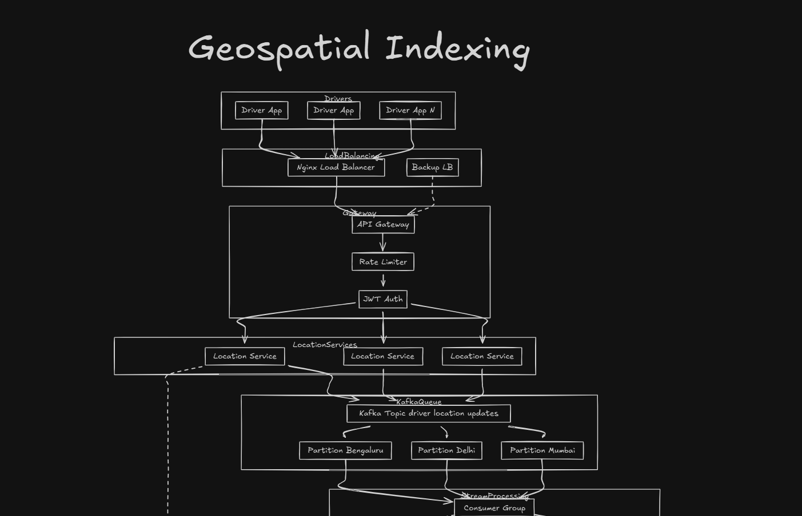
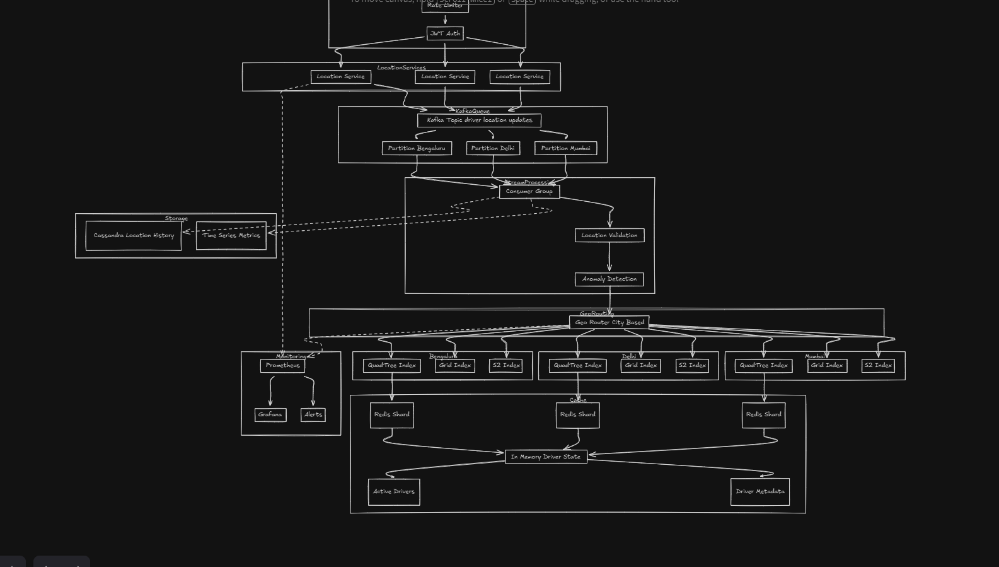

# Uber System Design - Geospatial Indexing

Learning Uber backend and scalability, specifically focusing on the **Geospatial Indexing** system for real-time driver location tracking and management.

## Overview

Uber's geospatial indexing system is designed to handle millions of driver location updates in real-time, enabling efficient spatial queries for ride matching, driver discovery, and location-based services. The system processes location data through multiple layers of validation, indexing, and caching to provide low-latency access to driver locations.

## Architecture Diagrams

The system architecture is illustrated in two complementary diagrams:

### Diagram 1: Data Ingestion Flow



**Diagram 1** shows the initial data ingestion flow from driver applications through load balancing, API gateway, and into Kafka queues with city-based partitioning. This diagram illustrates:

- **Top Layer**: Multiple driver app instances sending location updates
- **Load Balancing**: Nginx load balancer with backup LB for high availability
- **Gateway Layer**: API Gateway with Rate Limiter and JWT Authentication
- **Location Services**: Multiple horizontally scalable service instances
- **Kafka Queue**: Topic "driver location updates" with city-based partitions (Bengaluru, Delhi, Mumbai)
- **Stream Processing**: Consumer group consuming from Kafka partitions

### Diagram 2: Complete System Pipeline



**Diagram 2** provides a detailed view of the complete pipeline including stream processing, geo-routing, spatial indexing, caching, and monitoring. This comprehensive diagram shows:

- **Ingestion**: JWT Auth, Rate Limiter, and Location Services
- **Message Queue**: Kafka with city-based partitioning
- **Stream Processing**: Consumer Group with Location Validation and Anomaly Detection
- **Storage**: Cassandra for location history and Time Series Metrics
- **Monitoring**: Prometheus, Grafana, and Alerts
- **Geo-Routing**: City-based routing to spatial indexes
- **Spatial Indexing**: Quad Tree, Grid, and S2 indexes per city
- **Caching**: Redis shards per city
- **In-Memory State**: Centralized driver state with Active Drivers and Driver Metadata

## System Architecture

### High-Level Flow

```
Driver Apps → Load Balancer → API Gateway → Location Services → Kafka → 
Stream Processing → Geo-Routing → Spatial Indexes → Redis Cache → In-Memory State
```

## Component Breakdown

### 1. Client Layer

**Driver Applications** *(Visible in Diagram 1 - Top Layer)*
- Multiple driver app instances send location updates
- Each update includes: driver ID, latitude, longitude, timestamp, and metadata
- As shown in Diagram 1, multiple driver apps (Driver App, Driver App, Driver App N) send location updates simultaneously

### 2. Load Balancing Layer

**Nginx Load Balancer** *(Visible in Diagram 1 - Load Balancing Layer)*
- Distributes incoming requests across multiple backend services
- Provides high availability with a backup load balancer for failover
- Handles SSL termination and request routing

**Features:**
- Primary and backup load balancer configuration (as shown in Diagram 1 with Nginx Load Balancer and Backup LB)
- Health checks and automatic failover
- Request distribution based on geographic proximity or load
- The dashed arrow from Nginx Load Balancer to Backup LB indicates failover mechanism

### 3. Gateway Layer

**API Gateway** *(Visible in Diagram 1 - Gateway Layer)*
- Single entry point for all location update requests
- Routes requests to appropriate microservices
- As shown in Diagram 1, requests flow from Load Balancer → API Gateway → Rate Limiter → JWT Auth

**Rate Limiter** *(Visible in Diagram 1 & 2)*
- Protects backend services from traffic spikes
- Implements per-driver rate limiting
- Prevents abuse and ensures fair resource allocation
- Positioned after API Gateway in the request flow

**JWT Authentication** *(Visible in Diagram 1 & 2)*
- Validates driver identity using JSON Web Tokens
- Ensures only authenticated drivers can update their location
- Provides security and prevents unauthorized access
- Final security check before reaching Location Services

### 4. Location Services Layer

**Location Services (Multiple Instances)** *(Visible in Diagram 1 & 2 - LocationServices)*
- Horizontally scalable microservices handling location updates
- Each service instance processes location updates independently
- Performs initial validation and data normalization
- Diagram 1 shows three Location Service instances receiving requests from JWT Auth
- Diagram 2 shows the connection from Location Services to Storage (Cassandra)

**Responsibilities:**
- Receive authenticated location updates
- Validate coordinate ranges and data format
- Normalize location data
- Publish to Kafka queue

### 5. Message Queue Layer

**Kafka Queue: "driver location updates" Topic** *(Visible in Diagram 1 & 2 - KafkaQueue)*

As shown in both diagrams, Location Services publish to Kafka Topic "driver location updates". The topic is partitioned by city:

**City-Based Partitioning:** *(Visible in Diagram 1 - Three Partitions)*
- **Partition Bengaluru**: Handles location updates for drivers in Bengaluru
- **Partition Delhi**: Handles location updates for drivers in Delhi
- **Partition Mumbai**: Handles location updates for drivers in Mumbai

In Diagram 1, you can see arrows from the Kafka Topic branching into these three city-specific partitions, demonstrating the geographic partitioning strategy.

**Benefits of City-Based Partitioning:**
- **Geographic Isolation**: Each city's data is processed independently
- **Parallel Processing**: Multiple cities can be processed simultaneously
- **Scalability**: Easy to add new cities by adding new partitions
- **Fault Isolation**: Issues in one city don't affect others
- **Data Locality**: Related queries are likely to access the same partition

### 6. Stream Processing Layer

**Consumer Group** *(Visible in Diagram 1 & 2 - Stream Processing)*

As shown in Diagram 1, the Consumer Group consumes from all three city partitions. Diagram 2 shows the detailed processing pipeline:

**Processing Steps:** *(Visible in Diagram 2 - Sequential Processing)*

1. **Location Validation**
   - Validates coordinate accuracy
   - Checks for reasonable movement speeds
   - Filters out invalid or duplicate updates
   - Ensures data quality before indexing
   - Shown in Diagram 2 as the first processing step in the Consumer Group

2. **Anomaly Detection**
   - Detects unusual patterns (e.g., impossible speeds, teleportation)
   - Identifies GPS errors or malicious updates
   - Flags suspicious location data for review
   - Ensures data integrity
   - Shown in Diagram 2 as the second processing step after Location Validation

### 7. Storage Layer

**Cassandra - Location History** *(Visible in Diagram 2 - Storage Block)*
- Stores historical location data for analytics
- Time-series data storage for driver movement patterns
- Supports queries like "where was driver X at time Y"
- Used for fraud detection and analytics
- Diagram 2 shows a dashed line connection from Location Service to Storage, indicating async writes to Cassandra

**Time Series Metrics** *(Visible in Diagram 2 - Storage Block)*
- Stores system performance metrics
- Tracks processing latency, throughput, and error rates
- Used for monitoring and alerting
- Diagram 2 shows connections from both Location Services and Stream Processing Consumer Group to Time Series Metrics

### 8. Monitoring Layer

**Prometheus** *(Visible in Diagram 2 - Monitoring Block)*
- Collects metrics from all system components
- Time-series database for metrics storage
- Provides querying capabilities for metrics
- Diagram 2 shows Time Series Metrics feeding into Prometheus

**Grafana** *(Visible in Diagram 2 - Monitoring Block)*
- Visualizes metrics and system health
- Real-time dashboards for operations team
- Performance monitoring and trend analysis
- Connected to Prometheus in Diagram 2 for visualization

**Alerts** *(Visible in Diagram 2 - Monitoring Block)*
- Configurable alerting based on metrics thresholds
- Notifies on system anomalies or performance degradation
- Ensures proactive issue detection
- Also connected to Prometheus in Diagram 2

### 9. Geo-Routing Layer

**Geo Router (City-Based)** *(Visible in Diagram 2 - GeoRouting)*
- Routes validated location updates to city-specific indexing systems
- Determines which city a location belongs to
- Distributes load across city-specific indexers
- Ensures efficient spatial data organization
- Diagram 2 shows "Geo Router City Based" receiving output from Anomaly Detection and routing to city-specific indexes

### 10. Spatial Indexing Layer

Each city maintains three types of spatial indexes: *(Visible in Diagram 2 - Per City Indexes)*

**For Each City (Bengaluru, Delhi, Mumbai):**

As shown in Diagram 2, each city (Bengaluru, Delhi, Mumbai) has three parallel indexing structures:

1. **Quad Tree Index**
   - Hierarchical tree structure dividing space into quadrants
   - Efficient for point queries and range searches
   - Good for uniform distribution of drivers
   - O(log n) query time
   - Visible in Diagram 2 for each city

2. **Grid Index**
   - Divides geographic area into fixed-size grid cells
   - Simple and fast for nearby driver searches
   - Excellent for uniform grid-based queries
   - O(1) cell lookup, O(k) where k is drivers in cell
   - Visible in Diagram 2 for each city

3. **S2 Index**
   - Google's S2 geometry library for spherical geometry
   - Handles Earth's curvature accurately
   - Hierarchical cell-based indexing
   - Excellent for global-scale queries
   - Supports efficient nearest neighbor searches
   - Visible in Diagram 2 for each city

**Why Multiple Indexes?**
- Different indexes optimize for different query patterns
- Quad Tree: Good for hierarchical queries
- Grid: Fast for nearby searches in dense areas
- S2: Best for accurate geographic calculations
- Query router selects optimal index based on query type

### 11. Caching Layer

**Redis Shards (Per City)** *(Visible in Diagram 2 - Cache Layer)*
- Each city has its own Redis shard
- Caches frequently accessed driver locations
- Reduces load on spatial indexes
- Provides sub-millisecond read latency
- Diagram 2 shows each city's indexes (Quad Tree, Grid, S2) feeding into their respective Redis Shard

**Benefits:**
- **Low Latency**: In-memory access for hot data
- **Scalability**: Sharding by city distributes load
- **High Availability**: Redis cluster with replication
- The diagram clearly shows three Redis Shards (one per city) consolidating their data

### 12. In-Memory Driver State

**Centralized Driver State** *(Visible in Diagram 2 - Bottom Layer)*
- Aggregates data from all Redis shards
- Maintains current state of all active drivers
- Provides unified view for ride matching
- Diagram 2 shows all three Redis Shards converging into "In Memory Driver State"

**Outputs:** *(Visible in Diagram 2 - Final Outputs)*
- **Active Drivers**: List of currently available drivers
- **Driver Metadata**: Additional information (rating, vehicle type, etc.)
- Diagram 2 shows these as the final outputs branching from In Memory Driver State

## Data Flow Example

Following the path shown in **Diagram 1** and **Diagram 2**, here's how a location update flows through the system:

1. **Driver Update** *(Diagram 1 - Top)*: Driver app sends location update (lat: 12.9716, lng: 77.5946)
2. **Load Balancing** *(Diagram 1 - Load Balancing)*: Request routed through Nginx load balancer (with backup LB for failover)
3. **Authentication** *(Diagram 1 - Gateway)*: JWT token validated at API gateway
4. **Rate Limiting** *(Diagram 1 & 2 - Gateway)*: Request checked against rate limits
5. **Location Service** *(Diagram 1 & 2 - LocationServices)*: Update received and normalized by one of the Location Service instances
6. **Kafka** *(Diagram 1 & 2 - KafkaQueue)*: Published to "Bengaluru" partition (based on coordinates) - visible as Partition Bengaluru in both diagrams
7. **Stream Processing** *(Diagram 1 & 2 - Stream Processing)*: 
   - **Location Validation** (Diagram 2): Coordinates validated (in valid range)
   - **Anomaly Detection** (Diagram 2): Speed checked (reasonable, no teleportation)
8. **Storage** *(Diagram 2 - Storage)*: Historical data written to Cassandra (dashed line connection)
9. **Metrics** *(Diagram 2 - Storage)*: Processing metrics written to Time Series Metrics
10. **Geo-Routing** *(Diagram 2 - GeoRouting)*: Routed to Bengaluru indexing system via "Geo Router City Based"
11. **Spatial Indexing** *(Diagram 2 - Per City Indexes)*: Updated in all three indexes:
    - Quad Tree Index (Bengaluru)
    - Grid Index (Bengaluru)
    - S2 Index (Bengaluru)
12. **Redis Cache** *(Diagram 2 - Cache)*: Cached in Bengaluru Redis shard
13. **In-Memory State** *(Diagram 2 - Bottom)*: Updated in centralized driver state (aggregated from all Redis shards)
14. **Output** *(Diagram 2 - Final)*: Available as Active Drivers and Driver Metadata

**Monitoring Flow** *(Diagram 2 - Right Side)*:
- Time Series Metrics → Prometheus → Grafana (visualization) and Alerts (notifications)

## Design Decisions & Scalability

### Why City-Based Partitioning?

1. **Geographic Locality**: Most queries are city-specific
2. **Parallel Processing**: Independent processing per city
3. **Horizontal Scaling**: Easy to add new cities
4. **Fault Isolation**: City-level failure isolation
5. **Data Locality**: Related data stays together

### Why Multiple Spatial Indexes?

1. **Query Optimization**: Different indexes for different query types
2. **Performance**: Trade-offs between update speed and query speed
3. **Accuracy**: S2 handles Earth's curvature for global accuracy
4. **Flexibility**: Can route queries to best-performing index

### Why Kafka?

1. **High Throughput**: Handles millions of messages per second
2. **Durability**: Messages persisted and replicated
3. **Scalability**: Easy to add partitions and consumers
4. **Decoupling**: Producers and consumers are independent
5. **Replay Capability**: Can reprocess messages if needed

### Why Redis for Caching?

1. **Low Latency**: Sub-millisecond read times
2. **High Throughput**: Handles millions of operations per second
3. **Data Structures**: Supports complex data types
4. **Persistence**: Optional persistence for durability
5. **Sharding**: Easy horizontal scaling

### Scalability Considerations

- **Horizontal Scaling**: All components can scale horizontally
- **Partitioning**: City-based partitioning enables independent scaling
- **Caching**: Redis reduces load on expensive spatial queries
- **Async Processing**: Kafka enables asynchronous processing
- **Load Balancing**: Distributes load across service instances

## Performance Characteristics

- **Latency**: Sub-100ms for location updates end-to-end
- **Throughput**: Millions of location updates per second
- **Query Performance**: Sub-10ms for nearby driver queries
- **Availability**: 99.99% uptime with redundancy at every layer

## Use Cases

1. **Ride Matching**: Find nearest available drivers to rider location
2. **Surge Pricing**: Calculate demand based on driver density
3. **ETA Calculation**: Estimate arrival time based on driver locations
4. **Fraud Detection**: Detect unusual location patterns
5. **Analytics**: Historical location data for business insights

## Conclusion

Uber's geospatial indexing system demonstrates a sophisticated approach to handling real-time location data at scale. By combining city-based partitioning, multiple spatial indexes, distributed caching, and stream processing, the system achieves both high throughput and low latency while maintaining data quality and system reliability.
